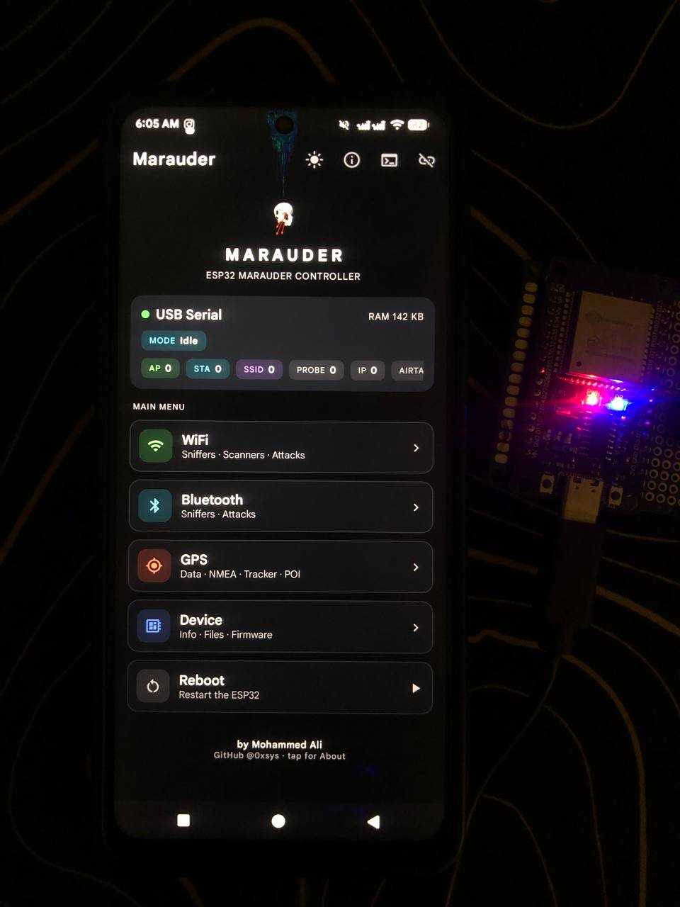
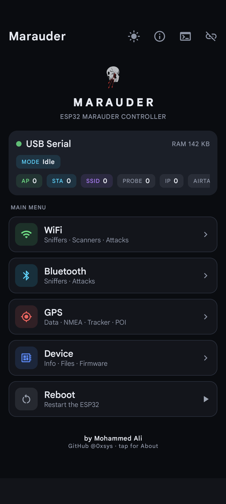
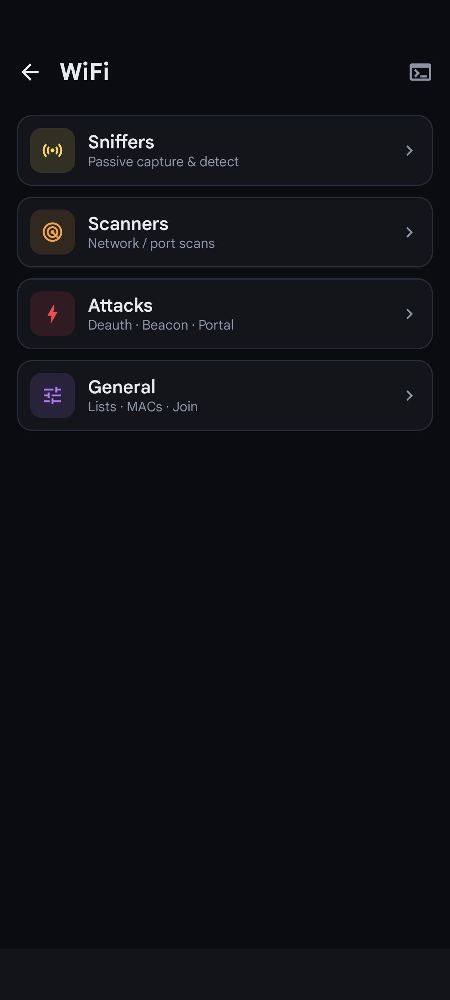
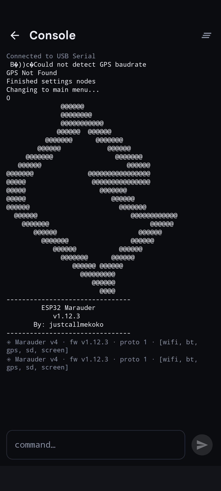

<div align="center">


# Marauder Mobile

**An Android controller for the [ESP32 Marauder](https://github.com/justcallmekoko/ESP32Marauder).**
Drive the firmware entirely over USB — no PC, no server, no extra hardware.

by **Mohammed Ali** · GitHub [@0xsys](https://github.com/0xsys)

</div>

---

## What it is

Marauder Mobile is a native Kotlin / Jetpack Compose app that turns an Android
phone into a full control surface for an ESP32 running the Marauder firmware. It
talks to the board over USB-OTG serial and speaks the firmware's **JSON serial
interface** (`jsoninfo` / `jsonstatus` / `jsonlist` / `jsonmode` + `analyzer`),
so instead of scraping human-readable CLI text it consumes clean, structured
`@J {…}` messages — letting you use the Marauder headlessly, without its screen.

The UI mirrors the on-device menus (same titles, same ordering): **WiFi →
Sniffers / Scanners / Attacks / General**, **Bluetooth → Sniffers / Attacks**,
**GPS**, **Device**. Every command opens its own **live results screen** that
streams in real time.

## Screenshots

<div align="center">



</div>

<div align="center">


&nbsp;

&nbsp;


</div>

## Requirements

- **An ESP32 running Marauder firmware** — that's it.
  No server, no desktop tool, no second device.
- An Android phone (Android 8.0 / **API 26+**) with **USB host / OTG** support.
- A USB-C / USB-OTG cable between the phone and the board.

Supported serial bridges: Silicon Labs CP210x, CH340/CH9102, FTDI, PL2303, and
Espressif native USB-CDC (ESP32-S2/S3/C3). The app can auto-launch when the board
is plugged in.

## Usage

1. Flash your ESP32 with a Marauder build that includes the JSON serial
   interface — see [Firmware](#firmware) below (available from
   [the fork](https://github.com/0xsys/ESP32Marauder) until it lands upstream).
2. Connect the board to your phone with a USB-OTG cable. Android offers to open
   **Marauder** and grants USB permission — or open the app first and tap
   **Connect**.
3. The app opens the port at **115200 8N1**, waits for the board to settle, then
   handshakes with `jsoninfo` and polls `jsonstatus`. The status panel shows
   board / firmware / capabilities, live scan mode, free heap and list counters.
4. Browse the menus. Each entry runs a real firmware command and opens a live view:
   - **Lists** — access points, stations, SSIDs, probes, IPs, AirTags
     (streamed via `jsonlist`).
   - **Analyzers** — Channel / BT graphs and the Channel Summary bar chart,
     streamed screen-free from the `asample` / `chan` messages.
   - **Console** — a raw serial terminal for anything not in the menus.

> ⚠️ The attack and spam features (deauth, beacon spam, BLE spam, …) are for
> **authorised testing only**. Use them exclusively on devices and networks you
> own or have explicit permission to test. You are responsible for complying with
> local law.

## Features

- 📡 Full WiFi suite — sniffers, scanners, and attacks with live counters.
- 🔵 Bluetooth — BLE sniffers, AirTag detection, and BLE spam tools.
- 🛰️ GPS — data, NMEA stream, tracker, and points of interest.
- 📈 Live analyzers — Channel Analyzer, BT Analyzer, and Channel Summary.
- 🗂️ Structured device lists parsed straight from the firmware.
- 🖥️ Raw serial console.
- 🎨 **Light & dark themes** — toggle from the main screen; the choice persists.
- 🔌 Auto-detect & auto-connect on USB attach.

## Protocol (firmware ↔ app)

- **App → device:** plain firmware CLI commands + `\n`. JSON helpers:
  `jsoninfo`, `jsonstatus`, `jsonmode 0|1`, `jsonlist a|s|c|i|p|t`, and
  `analyzer -t wifi|bt|chan`.
- **Device → app:** every machine-readable line is tagged `@J ` followed by a
  JSON object keyed by `t` (`info`, `status`, `jsonmode`, `ap`, `sta`, `ssid`,
  `ip`, `probe`, `airtag`, `end`, `err`, `asample`, `chan`). Any other line is
  treated as ordinary console text.

See `protocol/LineParser.kt` and the firmware's `JsonSerial.cpp` for the source
of truth.

## Themes

The app ships a dark theme (default) and a light theme. Toggle it from the icon
in the main screen's top bar; the choice is saved with DataStore and restored on
next launch.

## Building

Requirements: **JDK 21**, the **Android SDK** (compileSdk 35), and the bundled
Gradle wrapper (8.9). Point `local.properties` at your SDK:

```properties
sdk.dir=/path/to/Android/sdk
```

**Debug build + unit tests:**

```bash
./gradlew :app:assembleDebug :app:testDebugUnitTest
```

**Release build:**

```bash
./gradlew :app:assembleRelease
```

The signed APK lands at `app/build/outputs/apk/release/app-release.apk`.

### Release signing

Release signing is driven by an optional `keystore.properties` at the project
root. It (and the keystore) are **git-ignored** and must never be committed. If
the file is absent, the release build still compiles — just unsigned.

Create a keystore and a matching properties file:

```bash
keytool -genkeypair -v \
  -keystore marauder-release.jks -alias marauder \
  -keyalg RSA -keysize 2048 -validity 10000 \
  -dname "CN=Your Name, O=YourOrg, C=XX"
```

```properties
# keystore.properties  (project root; storeFile is resolved from here)
storeFile=marauder-release.jks
storePassword=your-store-password
keyAlias=marauder
keyPassword=your-key-password
```

> Keep the keystore and its passwords private — never put real credentials in
> this README, in `README`s, or anywhere in the repo. `keystore.properties` and
> `*.jks` are already git-ignored.

## Project layout

```
app/src/main/java/com/marauder/mobile/
├── data/          # menu catalog, list types, settings (DataStore)
├── protocol/      # @J line parser + typed DeviceMessage model
├── usb/           # USB-serial transport
├── vm/            # MarauderViewModel (state + command orchestration)
├── ui/            # Compose screens, components, theme
└── MainActivity.kt
```

## Firmware

This app needs an ESP32 Marauder firmware that includes the **JSON serial
interface**. That support is added in my fork (submitted upstream via
[PR #1346](https://github.com/justcallmekoko/ESP32Marauder/pull/1346)):

- **Firmware fork that supports this app:** <https://github.com/0xsys/ESP32Marauder>
  — branch [`feature/json-serial-interface`](https://github.com/0xsys/ESP32Marauder/tree/feature/json-serial-interface).
  Grab a prebuilt `.bin` from its **Releases**, or build it from source.
- Upstream Marauder: <https://github.com/justcallmekoko/ESP32Marauder>

Until the interface is merged upstream, flash the build from the fork above.

## Credits

- **Mohammed Ali** — GitHub [@0xsys](https://github.com/0xsys)
- Repository: <https://github.com/0xsys/ESP32-Marauder-Mobile>
- ESP32 Marauder firmware by [justcallmekoko](https://github.com/justcallmekoko/ESP32Marauder)

## License

Released under the [MIT License](LICENSE) © 2026 Mohammed Ali.
